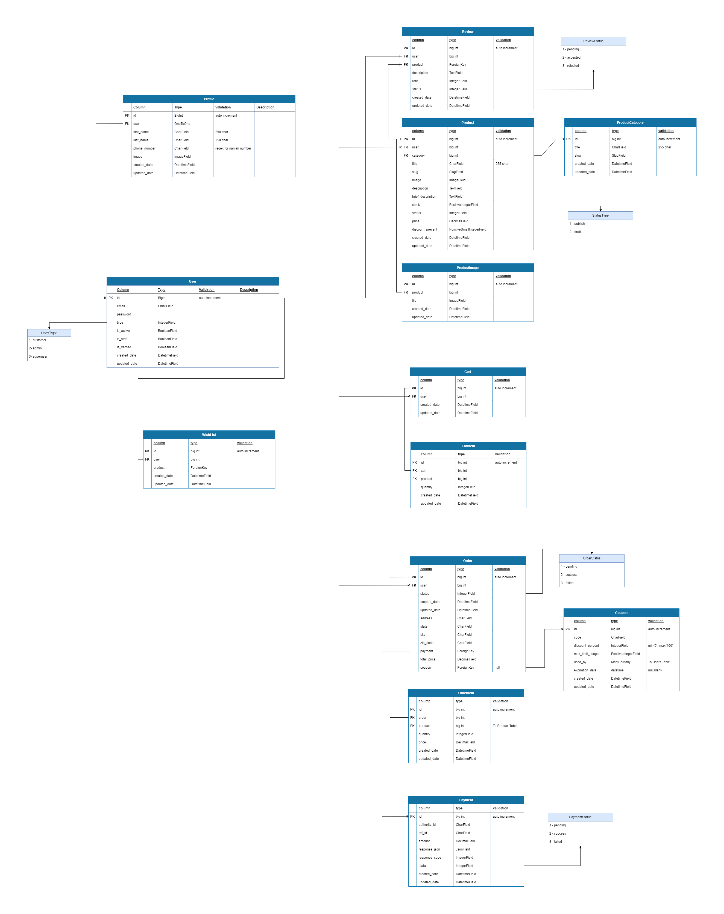

# 🛍️ Bazargan - Django E-commerce Website


Bazargan is a **modern**, **user-friendly** E-commerce platform built with **Django**, designed for **small to medium businesses** that need a customizable and lightweight online store.

---

## 📚 Table of Contents

- [✨ Features](#-features)
- [🛠️ Technologies](#-technologies)
- [🗄 Database Schema](#-database-schema)
- [📁 Project Structure](#-project-structure)
- [🚀 Installation](#-installation)
  - [⚙️ Prerequisites](#️-prerequisites)
  - [🔧 Manual Setup](#-manual-setup)
  - [🐳 Docker Deployment](#-docker-deployment)
- [🎯 Why This Project?](#-why-this-project)
- [🧪 Tests](#-tests)
- [🪲 Bugs & Issues](#-bugs--issues)
- [🤝 Contributing](#-contributing)
- [📜 License](#-license)

---

## ✨ Features

| Area             | Description                                                                 |
|------------------|-----------------------------------------------------------------------------|
| 🛍️ **Catalog**    | Product categories, variations, filters, and image galleries                |
| 👤 **Accounts**   | Registration, login, profile management, and order history                  |
| 🛒 **Cart**       | Session-based shopping cart system                                          |
| 💳 **Payments**   | Integrated with Zarinpal and Stripe for secure payments                    |
| 🧾 **Orders**     | Order processing and email confirmations                                   |
| ⚙️ **Admin**      | Django admin with custom features for product, order, and user management   |
| 📱 **Responsive** | Mobile-first design with clean and accessible UI                           |

---

## 🛠️ Technologies

- **Backend:** Django, Python 3.8+
- **Frontend:** HTML5, CSS3, Bootstrap, JavaScript
- **Database:** PostgreSQL (or SQLite for development)
- **Payments:** Zarinpal, Stripe
- **Deployment:** Docker, Docker Compose

---

## 🗄 Database Schema

> A simplified diagram of the project database schema.



---

## 📁 Project Structure
This Django project follows a well-organized, modular structure designed for scalability and maintainability. Below is an overview of the key directories and files:
```
├── docs/                      # Project documentation files
├── bazargan/                  # Django project root directory
│   ├── accounts/              # User authentication and registration app
│   ├── core/                  # Core project configuration and settings
│   ├── cart/                  # Shopping cart functionality
│   ├── order/                 # Order processing and management
│   ├── payment/               # Payment gateway integration
│   ├── shop/                  # Product and category management
│   ├── dashboard/             # User dashboards
│   │   ├── admin/             # Admin dashboard
│   │   └── customer/          # Customer dashboard
│   ├── website/               # Home and About us and Contact us pages app
│   ├── templates/             # HTML templates for all apps
│   ├── media/                 # User-uploaded media files
│   ├── static/                # Static assets (CSS, JS, images)
│   └── staticfiles/           # Collected static files for production
├── dockerfiles/               # Docker configuration
│    └── dev/                  # Development environment setup
│       └── django/            # Django service configuration
│            └── Dockerfile    # Django development container definition
├── envs/                      # Environment variables
│    └── dev/                  # Development environment variables
│       └── django/            # Django-specific variables
│            ├── .env.example  # Environment variables template
│            └── .env          # Actual environment file (generated from .env.example)
├── docker-compose.yml         # Docker compose configuration for services
├── requirements.txt           # Python dependencies
├── LICENSE                    # Project license file
└── README.md                  # Project overview and documentation
```

---

## 🚀 Installation

### ⚙️ Prerequisites

- Python 3.8+
- PostgreSQL 12+
- pip 20+
- virtualenv
- Docker & Docker Compose (for container setup)

### 🔧 Manual Setup

```bash
git clone https://github.com/SeyedAmirDev/BazarGan.git
cd BazarGan

python -m venv .venv
source .venv/bin/activate

pip install --upgrade pip
pip install -r requirements.txt

cp ./envs/dev/django/.env.example ./envs/dev/django/.env
nano ./envs/dev/django/.env  # Update your environment variables

cd bazargan
python manage.py migrate
python manage.py createsuperuser
python manage.py runserver
```

### 🐳 Docker Deployment

```bash
git clone https://github.com/SeyedAmirDev/BazarGan.git
cd BazarGan

cp ./envs/dev/django/.env.example ./envs/dev/django/.env
nano ./envs/dev/django/.env  # Update your environment variables

docker-compose up -d --build
docker-compose exec backend python manage.py migrate
docker-compose exec backend python manage.py createsuperuser
```

Visit `http://localhost:8000` to access the app.

---

## 🎯 Why This Project?

Bazargan is designed for:

- 🧑‍💼 Small businesses needing a clean and manageable store
- 🧑‍💻 Django developers learning shop/payment integration
- ⚒️ Custom shop projects (not a multi-vendor marketplace)

---
## 🪲 Bugs & Issues

Please report bugs or request features via the [Issues Page](https://github.com/SeyedAmirDev/BazarGan/issues).

---

## 🤝 Contributing

We welcome contributions!

1. Fork the project
2. Create a new branch (`git checkout -b feature/my-feature`)
3. Commit your changes (`git commit -m 'Add my feature'`)
4. Push and open a PR

Don’t forget to ⭐ the repository if you find it useful!

---

## 📜 License

This project is licensed under the [MIT License](LICENSE).

---

> Built with ❤️ using Django and PostgreSQL.